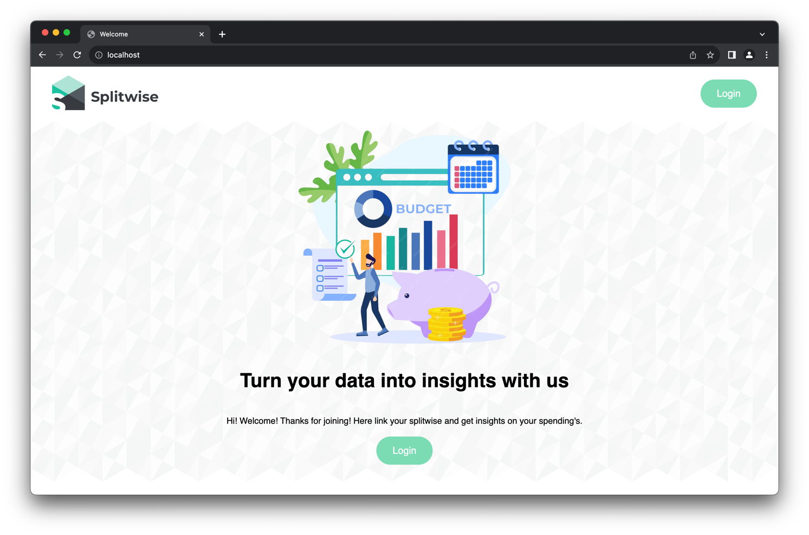
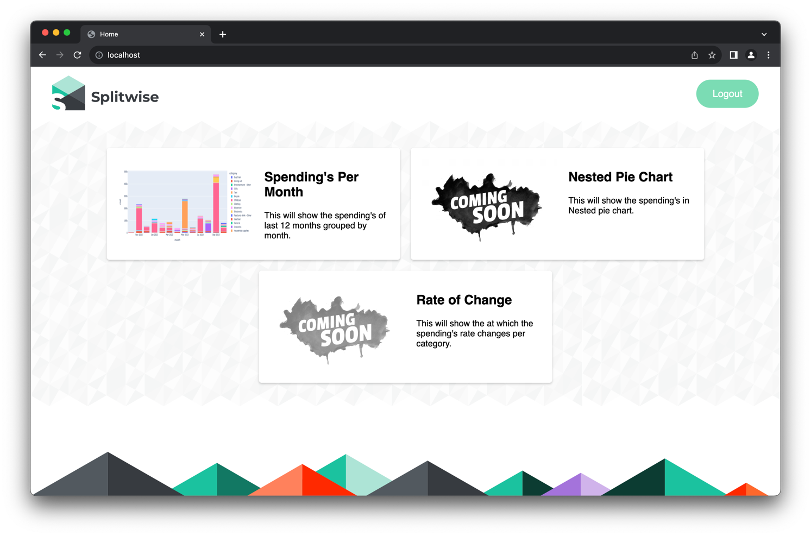
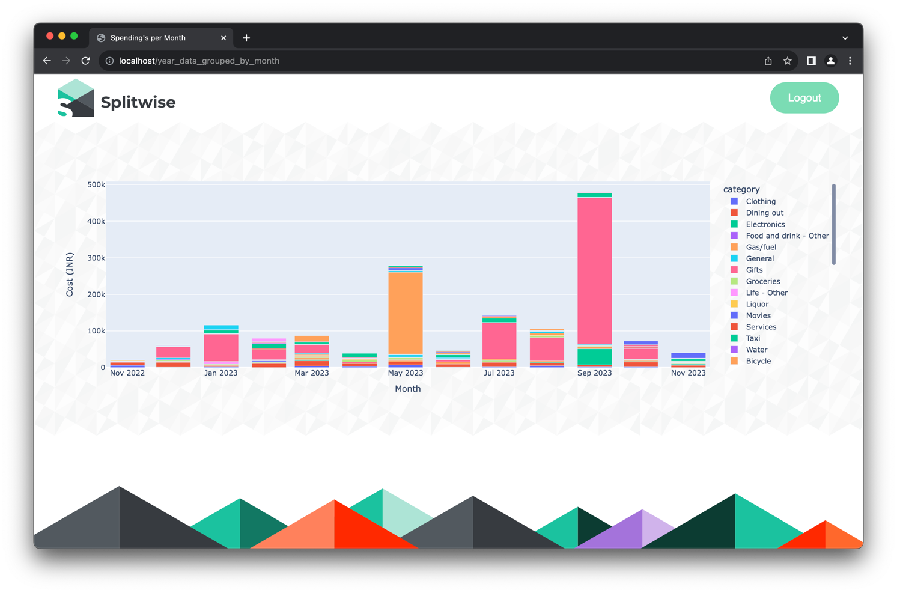
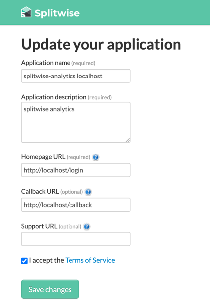

# Splitwise Analytics
Splitwise Analytics is an application designed to enhance your Splitwise experience by providing insightful graphs and analytics through OAuth 2.0 authentication.

### Features
- **OAuth 2.0 Integration:** Utilizes OAuth 2.0 for secure authentication and access to Splitwise.
- **Spending's Per Month:** This will show the spending's of last 12 months grouped by month.
- More features coming soon

### Screenshots




### Getting Started

- **Clone the Repository:**
  ```bash
  git clone https://github.com/RavitejaLam/splitwise-analytics.git
  ```
- **Install Dependencies:**
    ```bash
    cd splitwise-analytics
    pip install -r requirements.txt
    ```
- Set Up OAuth 2.0 Credentials
  - Visit the Splitwise Developer Portal (https://www.splitwise.com/apps) and create a new application
  - Obtain your Consumer key and Consumer Secret 
  - Set these credentials in the `.env` file
    ```
    CONSUMER_KEY = "******"
    CONSUMER_SECRET = "******"
    ```
- **Run the Application:**
    ```commandline
    python app.py
    ```
- **Access the Dashboard:**

   Open your web browser and navigate to http://localhost to access the Splitwise Analytics dashboard.

### Acknowledgements
- This project utilizes the Splitwise API (https://dev.splitwise.com/) to retrieve user data.
- Special thanks to the contributors and the Splitwise community for their support and inspiration.